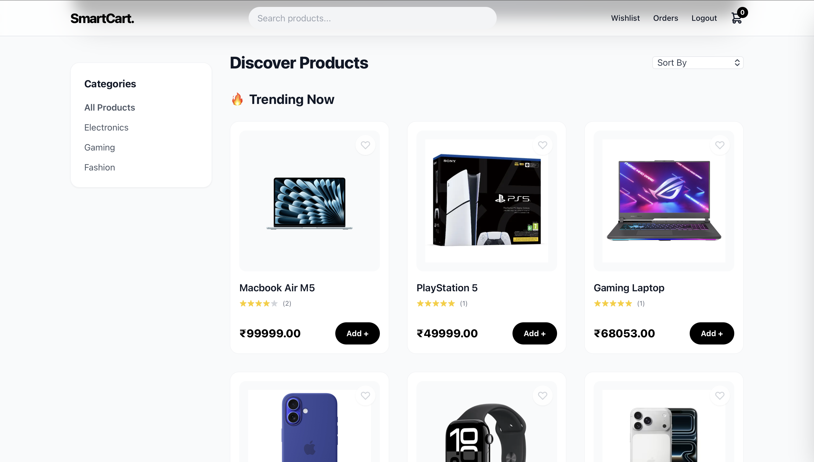
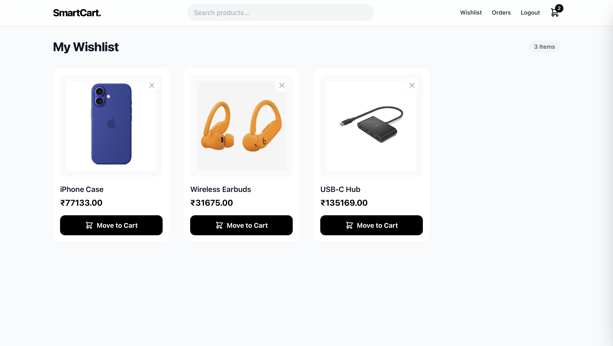
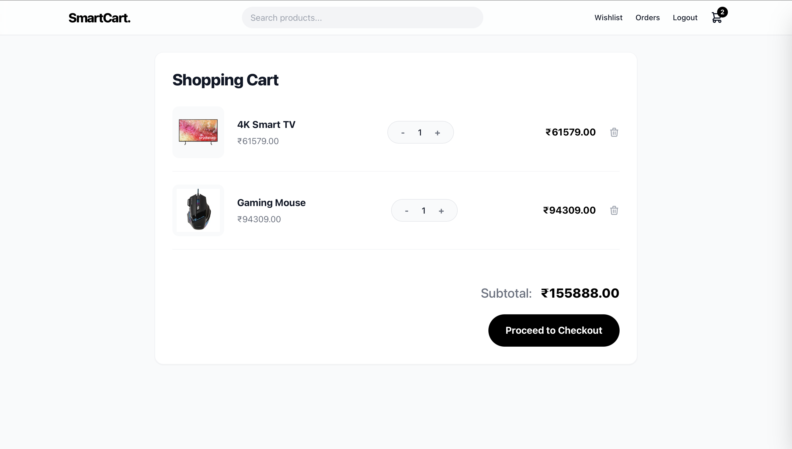
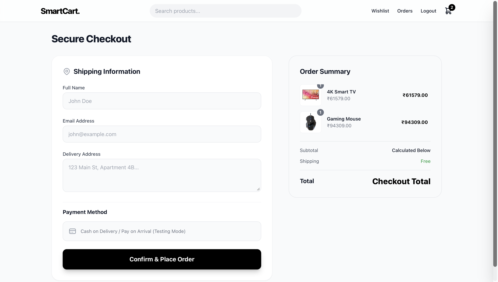

# SmartCart – Django Ecommerce Website

SmartCart is a full-stack ecommerce web application built with **Django**.  
It includes product browsing, wishlist, cart system, checkout, and order management.

---

## Features

- Product catalog
- Category filtering
- Search functionality
- Sorting (price low/high, newest)
- Trending products
- Wishlist system
- Shopping cart
- Checkout system
- Order history
- Product reviews
- Related product recommendations

---

## Tech Stack

Backend
- Django
- Python
- SQLite

Frontend
- HTML
- TailwindCSS
- JavaScript

---

## Project Structure

core/      → Django project settings
store/     → Product catalog & wishlist
cart/      → Shopping cart logic
orders/    → Checkout and order system
templates/ → Shared templates

---

## Screenshots

### Home Page

### Product Detail

### Wishlist

### Cart Drawer

### Checkout

---

## Installation

Clone the repository: